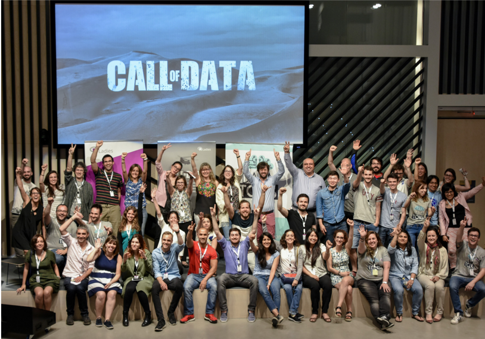
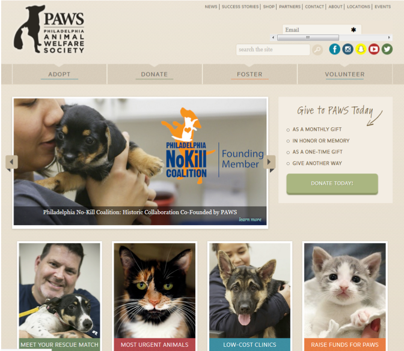
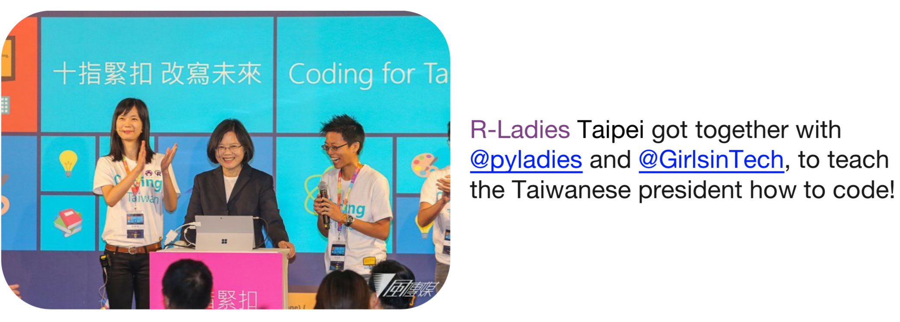

```{r setup, include=FALSE}
options(htmltools.dir.version = FALSE)
```
class: center

# Welcome!
### You are in the right place!
*whether you are an **R-novice** or an **R-expert**!*

```{r rlel-meetupheader, out.width = "350px", echo=FALSE}
knitr::include_graphics("../event-planning-promos/201807-First_meetup_header.png")
```

***

.left[
- <i class="fa fa-pencil fa-fw"></i> Please fill out our **Getting Started** survey: bit.ly/rlel-gettingstarted
- <i class="fa fa-meetup fa-fw"></i> If you are here, please make sure you have RSVP'ed on Meetup!
- <i class="fa fa-sign-in fa-fw"></i> Join us: bit.ly/rladies-eastlansing
]

---
class: center, inverse
# Let us know you!

.left[
### Pick up some `r emo::ji("pizza")`
### Find someone you've not met before! <br>
### Find out their:
1. Name <br>
2. Where are they from? <br>
3. How & When did they start using R? <br>
4. One interesting factoid about them! <br> <br>

### Introduce them to us! `r emo::ji("smiley")`
]

---
class: center

# Agenda
.pull-left[ .left[
### Intro
* to each other <i class="fa fa-check fa-fw"></i>
* to R-Ladies
* to R-Ladies East Lansing

### R
* Snapshot: R `r emo::ji("question")`
* Snapshot: Fun with R
* Snapshot: Data Vis. w/ R `r emo::ji("question")`
]]

.pull-right[ .left[
### Activities
- Topics for future meetups!

- Getting involved!

- Sign up

]]

---
class: center
# R community

```{r r-community-obsession, out.width = "500px", echo=FALSE}
knitr::include_graphics("../images/tweet-r-community-obsession.png")
```

<i class="fa fa-twitter fa-fw"></i>Credits: @DynamicWebPaige

---
class: center
# Who we R
```{r rladies-whoweare, out.width = "300px", echo=FALSE}
knitr::include_graphics("../images/rladies-who_we_are.png")
```

```{r rladies-collage, out.width = "300px", echo=FALSE}
knitr::include_graphics("../images/we-r-ladies_small-dagostino-mcgowan_lucy.png")
```

**Credits:** Lucy D'Agostino McGowan | R-Ladies Nashville

---
class: center
# Where we are: R-Ladies Worldwide
```{r rshinylady-map, out.width = "400px", echo=FALSE}
knitr::include_graphics("../images/rshinylady-stats-map.png")
```

**Credits:** Gabriela de Queiroz | R-Ladies Founder + Leadership Team + R-Ladies SF | https://gqueiroz.shinyapps.io/rshinylady/

.pull-left[
```{r rladies-collage1, out.width = "175px", echo=FALSE}
knitr::include_graphics("../rladies-photos/rladies-useR-collage1.png")
```
]
.pull-right[
```{r rladies-collage2, out.width = "200px", echo=FALSE}
knitr::include_graphics("../rladies-photos/rladies-useR-collage2.png")
```
]

---
class: center
# R-Ladies: A force for good

.pull-left[
.left[
**LatinR** | `r emo::ji("argentina")` `r emo::ji("brazil")` `r emo::ji("uruguay")` `r emo::ji("chile")` <br>
**ConectaR** | Costa Rica <br>
**Call of Data** | R-Ladies Madrid `r emo::ji("spain")` <br>
**Working with PAWS** | R-Ladies Philly `r emo::ji("us")` <br>
**UseR** | R-Ladies Global `r emo::ji("earth")` <br>
**R-Ladies Abstracts** | R-Ladies Global `r emo::ji("earth")`
**R-consortium** | policy change <i class="fa fa-arrow-right fa"></i> safe & inclusive events | R-Ladies Global `r emo::ji("earth")`
]]

.pull-right[
```{r rladies-philly-madrid, out.width = "200px", echo=FALSE}


```
]
--

```{r rladies-taipei, out.width = "400px", echo=FALSE}

```

---
class: center
# R-Ladies East Lansing

```{r rlel-timeline, out.width = "550px", echo=FALSE}
knitr::include_graphics("../images/rlel-timeline.png")
```

**Credits:** Adapted from UseR 2017!

--

```{r rlel-rlc-pic, out.width = "200px", echo=FALSE}
knitr::include_graphics("../rladies-photos/R-Ladies_EastLansing-Chicago/RLadies-EastLansing-Chicago.jpg")
```

**Meetup tips?** East Lansing meets Chicago | July 06, 2018!

---
class: center
# R-Ladies East Lansing
.pull-left[
#### User Level
```{r GSS-userlevel, out.width = "300px", echo=FALSE}
knitr::include_graphics("../images/GSS-user_level.png")
```
]

--
.pull-right[
#### R usage scope
```{r GSS-rusage, out.width = "325px", echo=FALSE}
knitr::include_graphics("../images/GSS-Rusage.png")
```
]
--

#### R-user Level
```{r GSS-ruserlevel, out.width = "400px", echo=FALSE}
knitr::include_graphics("../images/GSS-Ruser_level.png")
```

---
class: center, inverse
# R-Ladies East Lansing
## Things we could do `r emo::ji("thinking")`

<i class="fa fa-eye fa"></i> Choose topics you would like to (Learn | Teach | Help) <br> <br>
<i class="fa fa-sticky-note fa"></i> Pick the corresponding large stickies <br> <br>
<i class="fa fa-pencil fa"></i> Write your names <br> <br>
<i class="fa fa-check fa"></i> Stick them below the topics of your interest <br> <br>
<i class="fa fa-plus fa-fw"></i> Feel free to add additional comments/ideas in your stickies <br> <br>
<i class="fa fa-search fa-fw"></i> Find Camille/me if you need help <br> <br>

---
class: center
# Get involved
```{r rladies-gettinginvolved, out.width = "500px", echo=FALSE}
knitr::include_graphics("../images/rladies-getting-involved.png")
```

--

**Learn <i class="fa fa-leanpub fa-fw"></i> <br>
Present/Teach/Lead discussions `r emo::ji("teacher")` <br>
Be an R helper: Technical <i class="fa fa-terminal fa-fw"></i> <br>
Social `r emo::ji("butterfly")` <i class="fa fa-twitter fa-fw"></i> <i class="fa fa-facebook fa-fw"></i> <i class="fa fa-meetup fa-fw"></i> <br>
Website & Blogs: <i class="fa fa-github fa-fw"></i> <i class="fa fa-file-code fa-fw"></i> <br>
Content management: <i class="fa fa-github fa-fw"></i> <i class="fa fa-google fa-fw"></i>Drive**

---
class: center, inverse
# Get involved

.pull-left[.left[
Learn <i class="fa fa-leanpub fa-fw"></i> <br> <br>
Present/Teach/Lead discussions `r emo::ji("teacher")` <br> <br>
Be an R helper: Technical `r emo::ji("computer")` <br> <br>
]]
.pull-right[.left[
Social `r emo::ji("butterfly")` <i class="fa fa-twitter fa-fw"></i> <i class="fa fa-facebook fa-fw"></i> <i class="fa fa-meetup fa-fw"></i> <br> <br>
Website & Blogs: <i class="fa fa-github fa-fw"></i> <i class="fa fa-file-code fa-fw"></i> <br> <br>
Content management: <i class="fa fa-github fa-fw"></i> <i class="fa fa-google fa-fw"></i>Drive <br>
]]
***
<i class="fa fa-sticky-note fa"></i> Pick small stickies <br> <br>
<i class="fa fa-pencil fa"></i> Write your names <br> <br>
<i class="fa fa-check fa"></i> Stick 1 up against each of these <br> <br>
<i class="fa fa-search fa-fw"></i> Find Camille/me if you need help <br> <br>

---
class: center, inverse
# Next meeting(s)?
### Show of hands! `r emo::ji("raised")`

**How often should we meet?** `r emo::ji("calendar")` Biweekly? <br> <br>
--

**Fall schedule** `r emo::ji("fallen leaf")` Every other Monday, 6-730p? <br> <br>
--

***

**First 3 meetings** `r emo::ji("lightning")` Lightning talks? <br> <br>
How do you use R in your work? <br>
Cool R packages?
--

***

## Please sign up! <br>

---
class: center
# Fun with R!

Want to add **GIFs** to your RMarkdown presentation?

```{r giphyr, tidy=TRUE, eval=FALSE}
install.packages("giphyr")

# install.packages("devtools")
devtools::install_github("haozhu233/giphyr") #<<
```

  
<i class="fa fa-github fa-fw"></i>Credits: haozhu233/giphyr
---
class: center
# Fun with R!

Want to add **emojis** to your RMarkdown presentation? `r emo::ji("cool")`

```{r emo, tidy=TRUE, eval=FALSE}
# install.packages("devtools")
devtools::install_github("hadley/emo") #<<
```
<i class="fa fa-github fa-fw"></i>Credits: hadley/emo

--

Want **coffee stains** on your documents instead? `r emo::ji("coffee")`


<i class="fa fa-coffee fa-fw"></i>Credits: Hanno Rein | hanno-rein.de

---
class: center
# How-to-R
.pull-left[
```{r tweet-r-in-3steps, out.width = "250px", echo=FALSE}
knitr::include_graphics("../images/tweet-rin3steps.png")
```
]

.pull-right[
```{r tweet-impostR, out.width = "300px", echo=FALSE}
knitr::include_graphics("../images/tweet-impostR.png")
```
<br> <br> <br> <br>

]

```{r tweet-familiar2me, out.width = "450px", echo=FALSE}
knitr::include_graphics("../images/tweet-familiar2me.png")
```

<i class="fa fa-twitter fa-fw"></i>Credits: @kierisi | @moietymouse | @mpjme

---
class: center
# Acknowledgements

.pull-left[ .left[

#### People
- Camille Archer <i class="fa fa-university fa-fw"></i> ICER, MSU
- Arjun Krishnan <i class="fa fa-university fa-fw"></i> CMSE, MSU
- Nate Davis <i class="fa fa-university fa-fw"></i> MSU Data Science
- Nichole Nadkarni <i class="fa fa-industry fa-fw"></i> Red Fish Viral

#### R-Ladies
- Katherine Simeon & Amy Wang <br><i class="fa fa-map-marker fa-fw"></i>Chicago `r emo::ji("us")`
- Jen Richmond <i class="fa fa-map-marker fa-fw"></i> Sydney `r emo::ji("australia")`
- Melina Vidoni <i class="fa fa-map-marker fa-fw"></i>Santa Fe `r emo::ji("argentina")`
- Jennifer Thompson <i class="fa fa-map-marker fa-fw"></i>Nashville `r emo::ji("us")`
- Alison P Hill <i class="fa fa-map-marker fa-fw"></i>Portland `r emo::ji("us")`
- Bruna Wundervald <i class="fa fa-map-marker fa-fw"></i>Curitiba `r emo::ji("brazil")`
]]


.pull-right[ .left[
#### Packages & communities
- Xaringan theme <i class="fa fa-github fa-fw"></i> yihui/xaringan
  - R-Ladies `r emo::ji("argentina")` <i class="fa fa-github fa-fw"></i> rbind/apreshill
- KnitR, R Markdown, remark.js
- Emo, GiphyR, FontAwesome
- MeetupR | Gabriela de Queiroz `r emo::ji("us")` <i class="fa fa-github fa-fw"></i> rshinylady
- R-Ladies Global `r emo::ji("earth")` <i class="fa fa-slack fa-fw"></i> <i class="fa fa-github fa-fw"></i>
- R-Ladies Remote `r emo::ji("satellite")` <i class="fa fa-slack fa-fw"></i>

#### Today's Sponsor!

```{r icermsu, out.width = "200px", echo=FALSE}
knitr::include_graphics("../sponsors-contacts/icer-msu.png")
```
]]

--

<i class="fa fa-users fa-fw"></i> _All you folks for being here for our Kick-off meeting!_

--


---
class: center, inverse
# Find us Online!

.pull-left[ .left[ 
#### R-Ladies
##### East Lansing
<a href="mailto:eastlansing@rladies.org"><i class="fa fa-paper-plane fa-fw"></i>&nbsp; eastlansing@rladies.org</a><br>
<a href="http://twitter.com/RLadiesELansing"><i class="fa fa-twitter fa-fw"></i>&nbsp; @RLadiesELansing</a><br>
<a href="http://meetup.com/rladies-east-lansing/"><i class="fa fa-meetup fa-fw"></i>&nbsp; rladies-east-lansing</a><br>
<a href="http://github.com/rladies-eastlansing"><i class="fa fa-github fa-fw"></i>&nbsp; @rladies-eastlansing</a><br>
<a href="https://rladies-eastlansing.slack.com"><i class="fa fa-slack fa-fw"></i>&nbsp; rladies-eastlansing.slack.com</a><br>
<a href="ICER #1455A, MSU"><i class="fa fa-map-marker fa-fw"></i>&nbsp; ICER, Michigan State University</a>

##### Global
<a href="https://rladies.org"><i class="fa fa-link fa-fw"></i>&nbsp; rladies.org</a><br>
<a href="http://twitter.com/RLadiesGlobal"><i class="fa fa-twitter fa-fw"></i>&nbsp; @RLadiesGlobal</a><br>

]]

.pull-right[ .left[ 
#### Organizers
##### Janani Ravi
<a href="mailto:jananiravi@rladies.org"><i class="fa fa-paper-plane fa-fw"></i>&nbsp; jananiravi@rladies.org</a><br>
<a href="http://github.com/jananiravi"><i class="fa fa-github fa-fw"></i>&nbsp; @jananiravi</a><br>
<a href="http://twitter.com/janani137"><i class="fa fa-twitter fa-fw"></i>&nbsp; @janani137</a><br>
<a href="https://jananiravi.github.io"><i class="fa fa-link fa-fw"></i>&nbsp; jananiravi.github.io</a><br>

##### Camille Archer
<a href="mailto:camille@rladies.org"><i class="fa fa-paper-plane fa-fw"></i>&nbsp; camille@rladies.org</a><br>
<a href="http://github.com/archerc5"><i class="fa fa-github fa-fw"></i>&nbsp; @archerc5</a><br>
<a href="http://twitter.com/camillearcher5"><i class="fa fa-twitter fa-fw"></i>&nbsp; @camillearcher5</a><br>
<a href="http://facebook.com/camille.archer.1"><i class="fa fa-facebook fa-fw"></i>&nbsp; camille.archer.1</a><br>
]]

