```{r setup, include=FALSE}
options(htmltools.dir.version = FALSE)
```
class: center

# Welcome!
### You are in the right place!
*whether you are an **R-novice** or an **R-expert**!*

```{r rlel-meetupheader, out.width = "400px", echo=FALSE}
knitr::include_graphics("../event-planning-promos/201807-First_meetup_header.png")
```

### Let us know you!
.left[
- <i class="fa fa-pencil fa-fw"></i> Please fill out our **Getting Started** survey: bit.ly/rlel-gettingstarted
- <i class="fa fa-meetup fa-fw"></i> If you are here, please make sure you have RSVP'ed on Meetup!
- <i class="fa fa-sign-in fa-fw"></i> Join us: bit.ly/rladies-eastlansing
]

---
class: center

# Agenda
.pull-left[ .left[
### Intro
* to each other
  * pick a partner
* to R-Ladies

### R
* Snapshot: R
* Snapshot: Fun with R
* Snapshot: Data Vis. w/ R
]]

.pull-right[ .left[
### Activities
- Topics for future meetups!
  - Help us help you!
  - Find Camille/me
  - Pick up your stickies (big)
  - Vote on all topics

- Getting involved!
  - Help <i class="fa fa-users fa-fw"></i> :)
  - Pick up your stickies (small)
  - Find Camille/me
  - What would you like to do?
]]

---
class: center
# Who we are
```{r rladies-whoweare, out.width = "300px", echo=FALSE}
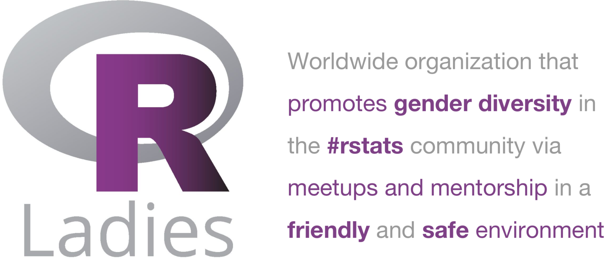
```

```{r rladies-collage, out.width = "300px", echo=FALSE}
knitr::include_graphics("../images/we-r-ladies_small-dagostino-mcgowan_lucy.png")
```

**Credits:** Lucy D'Agostino McGowan | R-Ladies Nashville

---
class: center
# Where we are: R-Ladies Worldwide
```{r rshinylady-map, out.width = "400px", echo=FALSE}
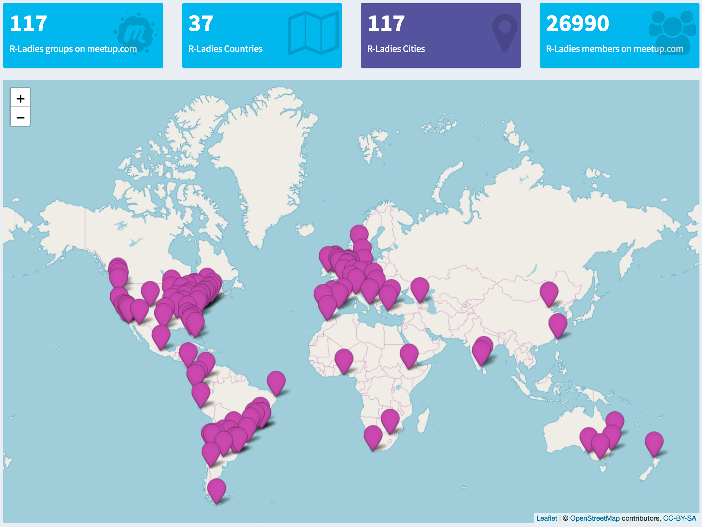
```

**Credits:** Gabriela de Queiroz | R-Ladies Founder + Leadership Team + R-Ladies SF | https://gqueiroz.shinyapps.io/rshinylady/

.pull-left[
```{r rladies-collage1, out.width = "175px", echo=FALSE}
knitr::include_graphics("../rladies-photos/rladies-useR-collage1.png")
```
]
.pull-right[
```{r rladies-collage2, out.width = "200px", echo=FALSE}
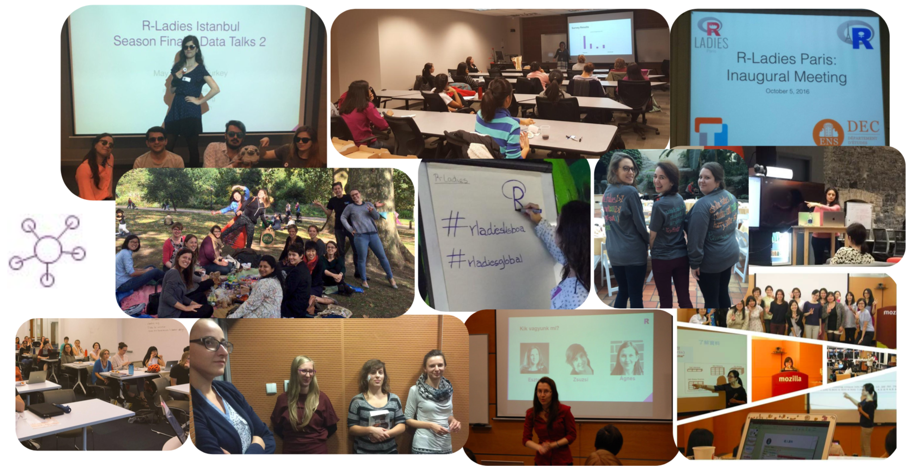
```
]

---
class: center
# R-Ladies giving back

**LatinR** | Argentina, Brazil, Uruguay, Chile

**ConectaR** | Costa Rica

**Call of Data** | R-Ladies Madrid

**Contribution to PAWS** | R-Ladies Philly

**UseR** | R-Ladies Global & individual chapters

**R-consortium** | policy change towards safe & inclusive events | R-Ladies Global
<br>

--

```{r rladies-taipei, out.width = "500px", echo=FALSE}
knitr::include_graphics("../images/rladies-taipei-givingback.png")
```

---
class: center
# R-Ladies East Lansing

```{r rlel-timeline, out.width = "550px", echo=FALSE}
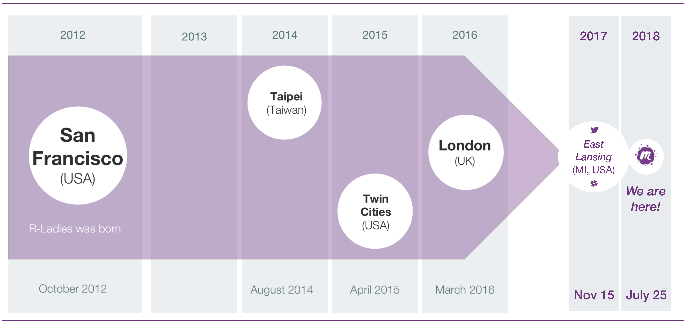
```

**Credits:** Adapted from UseR 2017!

--

```{r rlel-rlc-pic, out.width = "200px", echo=FALSE}
knitr::include_graphics("../rladies-photos/R-Ladies_EastLansing-Chicago/RLadies-EastLansing-Chicago.jpg")
```

**Meetup tips?** East Lansing meets Chicago | July 06, 2018!

---
class: center
# R-Ladies East Lansing
.pull-left[
### User Level

```{r GSS-userlevel, out.width = "450px", echo=FALSE}
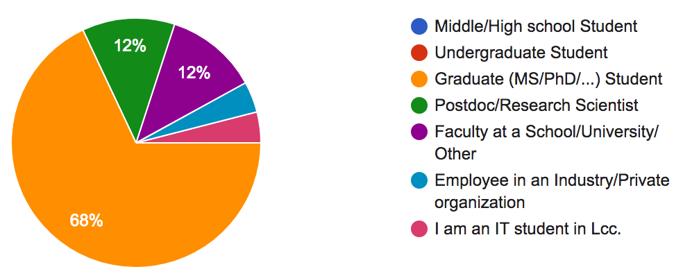
```
]

--
.pull-right[
### Using R for

```{r GSS-rusage, out.width = "450px", echo=FALSE}
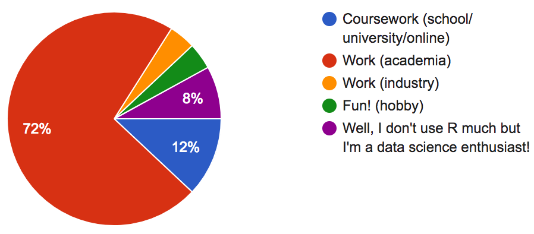
```
]
--

### R-user Level

```{r GSS-ruserlevel, out.width = "400px", echo=FALSE}
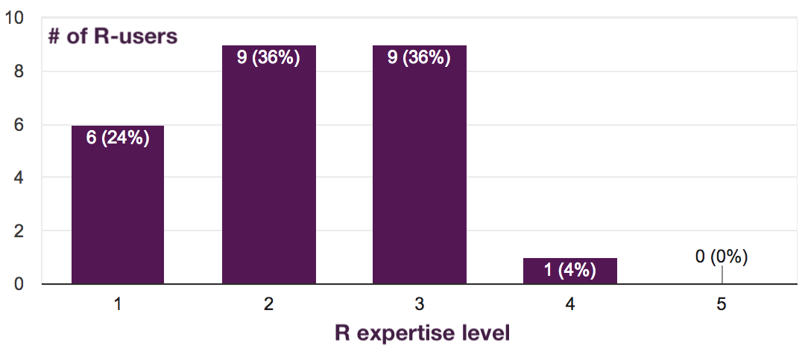
```

---
class: center
# R-Ladies East Lansing
## What we could do `r emo::ji("thinking")`

<i class="fa fa-search fa-fw"></i> Find Camille/me <br>
<i class="fa fa-sticky-note fa"></i> Pick your large stickies (Learn/Teach/Help) <br>
<i class="fa fa-pencil fa"></i> Write your names <br>
<i class="fa fa-check fa"></i> Vote on the potential topics <br>
<i class="fa fa-plus fa-fw"></i> Add new ones (if you have specific ideas, add under broader topic sheets) <br>

---
class: center
# Get involved
```{r rladies-gettinginvolved, out.width = "400px", echo=FALSE}
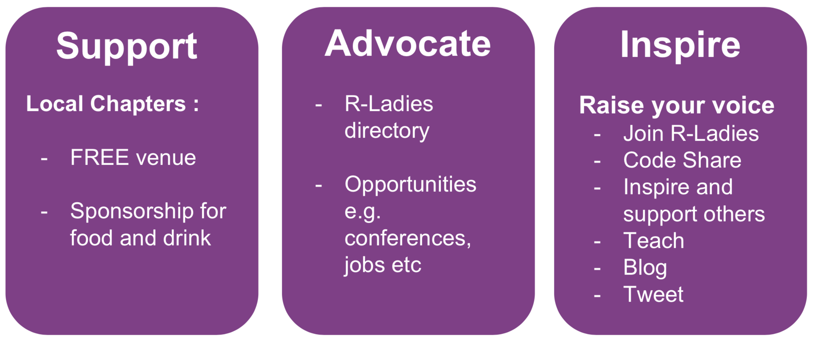
```

--

**Learn <i class="fa fa-leanpub fa-fw"></i> <br>
Present/Teach/Lead discussions `r emo::ji("teacher")` <br>
Be an R helper: Technical <i class="fa fa-terminal fa-fw"></i> <br>
Social `r emo::ji("butterfly")`: <i class="fa fa-twitter fa-fw"></i> <i class="fa fa-facebook fa-fw"></i> <i class="fa fa-meetup fa-fw"></i> <br>
Website & Blogs: <i class="fa fa-github fa-fw"></i> <i class="fa fa-file-code fa-fw"></i> <br>
Content management: <i class="fa fa-github fa-fw"></i> <i class="fa fa-google fa-fw"></i>Drive**

---
class: center
# Get involved


**Learn <i class="fa fa-leanpub fa-fw"></i> <br>
Present/Teach/Lead discussions `r emo::ji("teacher")` <br>
Be an R helper: Technical <i class="fa fa-terminal fa-fw"></i> <br>
Social `r emo::ji("butterfly")`: <i class="fa fa-twitter fa-fw"></i> <i class="fa fa-facebook fa-fw"></i> <i class="fa fa-meetup fa-fw"></i> <br>
Website & Blogs: <i class="fa fa-github fa-fw"></i> <i class="fa fa-file-code fa-fw"></i> <br>
Content management: <i class="fa fa-github fa-fw"></i> <i class="fa fa-google fa-fw"></i>Drive**

**How often should we meet? When?** <i class="fa fa-calendar fa-fw"></i>

***
<i class="fa fa-search fa-fw"></i> Find Camille/me <br>
<i class="fa fa-sticky-note fa"></i> Pick your small stickies <br>
<i class="fa fa-pencil fa"></i> Write your names <br>
<i class="fa fa-check fa"></i> Stick up 1-3 of these against each topic <br>


---
class: center
# How-to-R

```{r tweet-r-in-3steps, out.width = "250px", echo=FALSE}
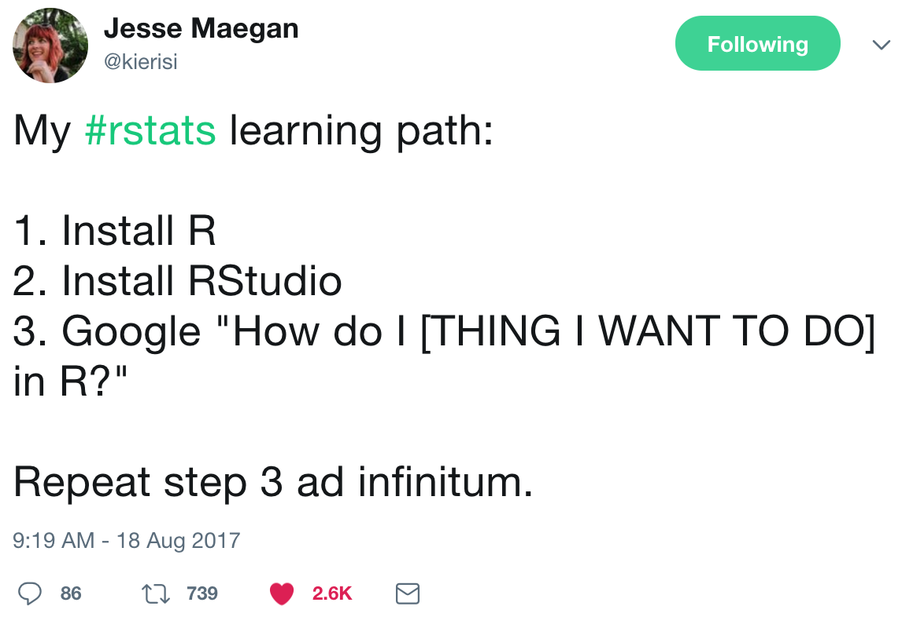
```

--

```{r tweet-impostR, out.width = "250px", echo=FALSE}
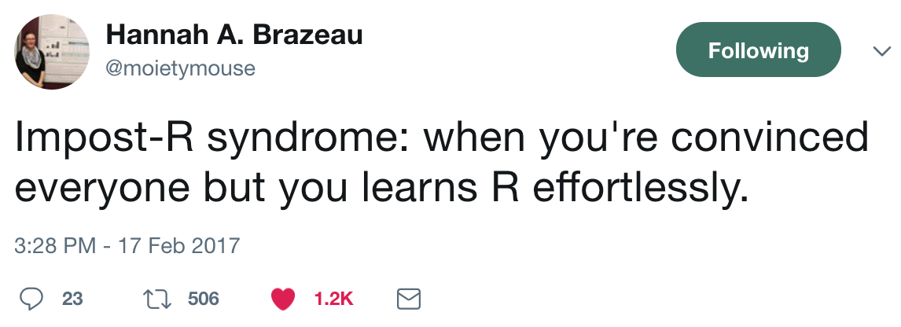
```

--

```{r tweet-familiar2me, out.width = "250px", echo=FALSE}
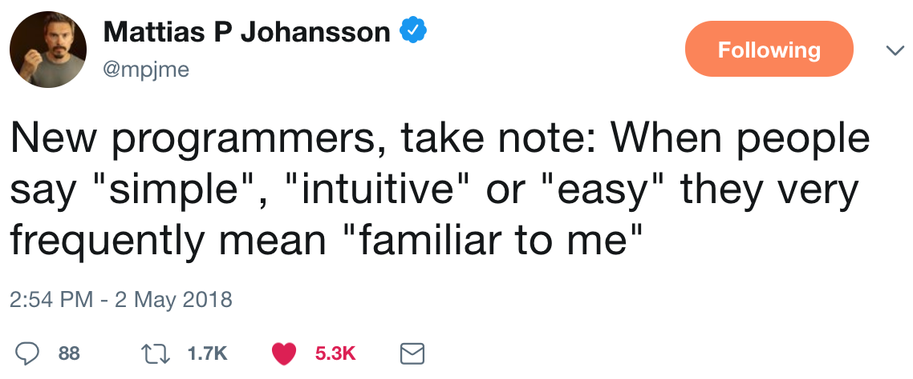
```

<i class="fa fa-twitter fa-fw"></i>Credits: @kierisi | @moietymouse | @mpjme

---
class: center
# How-to-R
## Cooking or coding?

```{r tweet-r-codinglikecooking, out.width = "400px", echo=FALSE}

```

```{r r-codinglikecooking, out.width = "400px", echo=FALSE}
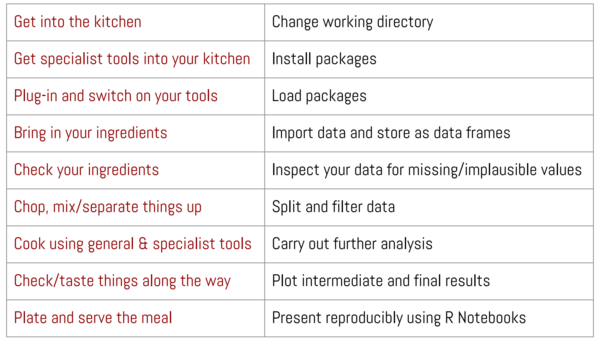
```

<i class="fa fa-twitter fa-fw"></i>Credits: @SonyaEisenbeiss , @compbiologist

---
class: center
# How-to-R
## R ecosystem

```{r r-ecosystem-arjun, out.width = "350px", echo=FALSE}
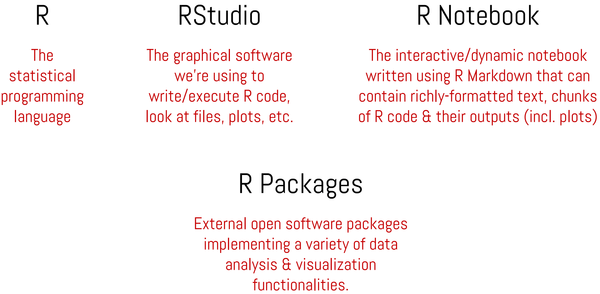
```

```{r flowchart-datascience, out.width = "250px", echo=FALSE}
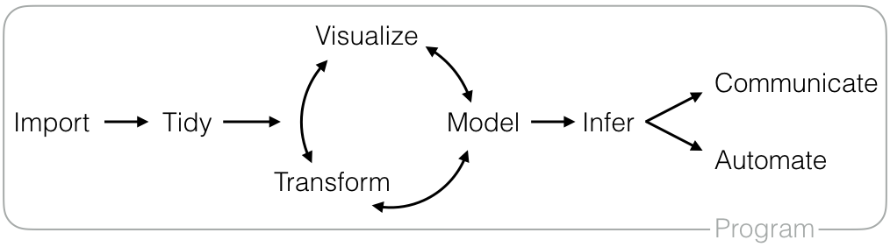
```

<i class="fa fa-twitter fa-fw"></i>Credits: @compbiologist

---
class: center
# How-to-R

.pull-left[
```{r r-gettinghelp, out.width = "500px", echo=FALSE}
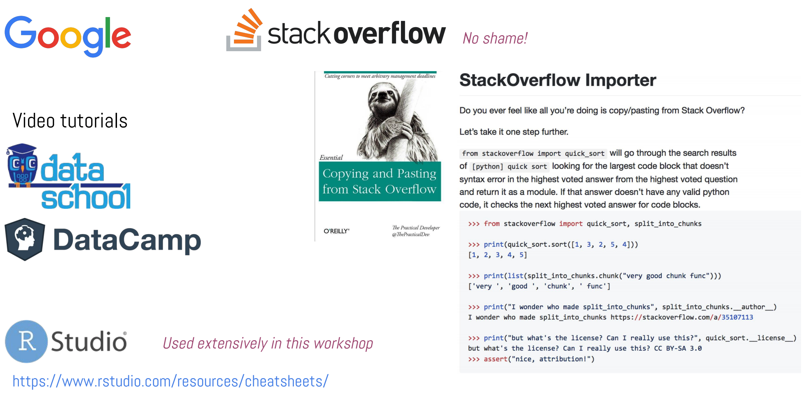
```

```{r r-community-obsession, out.width = "300px", echo=FALSE}
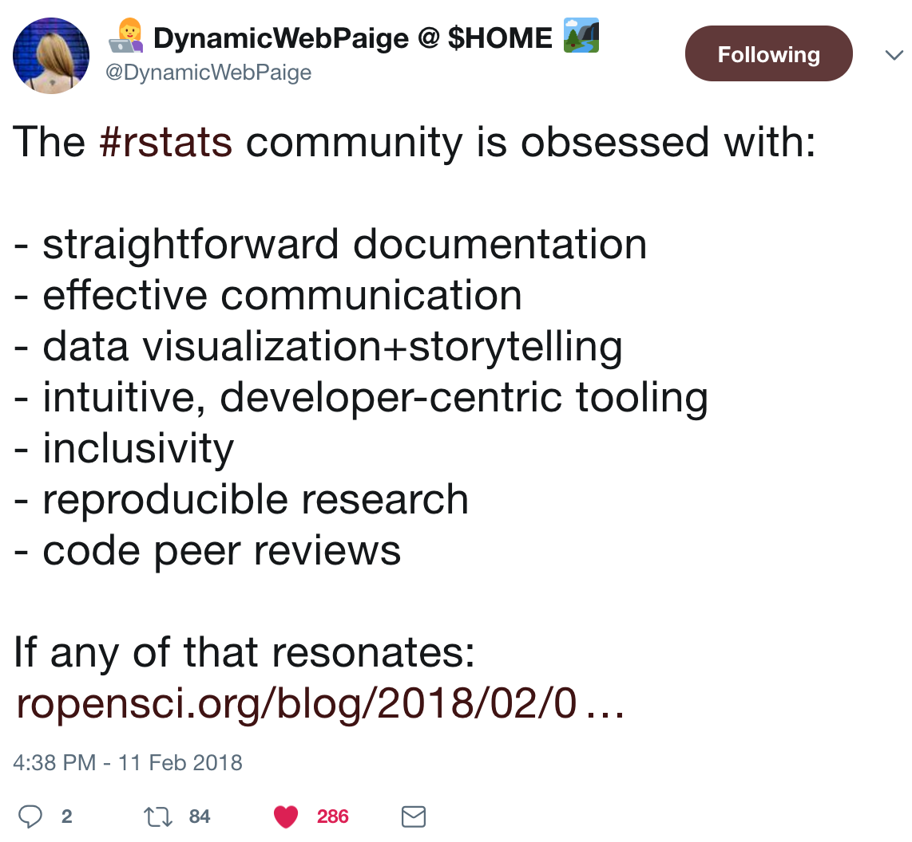
```
]

.pull-right[
```{r r-datascience-books, out.width = "300px", echo=FALSE}
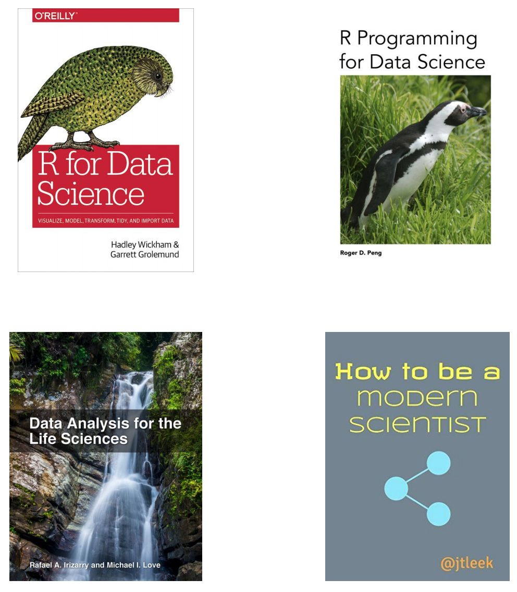
```
]

<i class="fa fa-twitter fa-fw"></i>Credits: @DynamicWebPaige | @compbiologist

---
class: center
# R for DataViz
.pull-left[.left[
```{r rgraphgallery-logo, out.width = "100px", echo=FALSE}
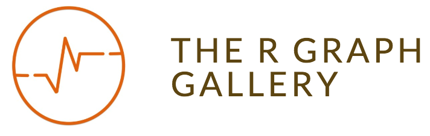
```
```{r rgraphgallery, out.width = "500px", echo=FALSE}
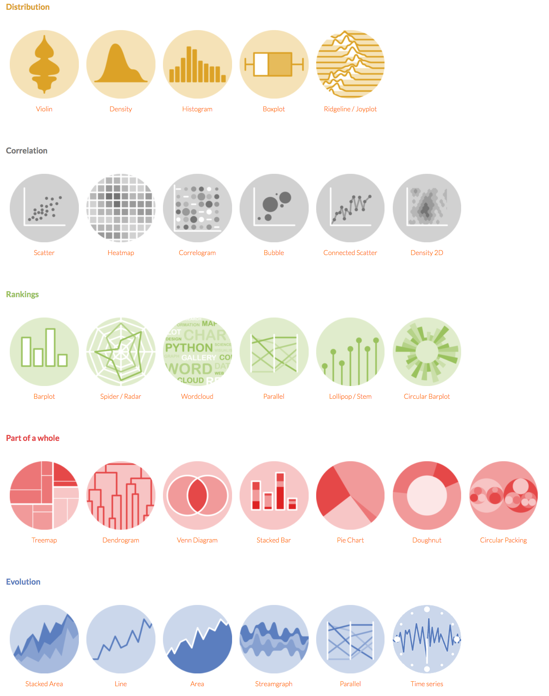
```

]]

.pull-right[.left[
```{r datatoviz-logo, out.width = "100px", echo=FALSE}
knitr::include_graphics("../images/datatoviz-logo.png")
```
```{r datatoviz-poster, out.width = "500px", echo=FALSE}
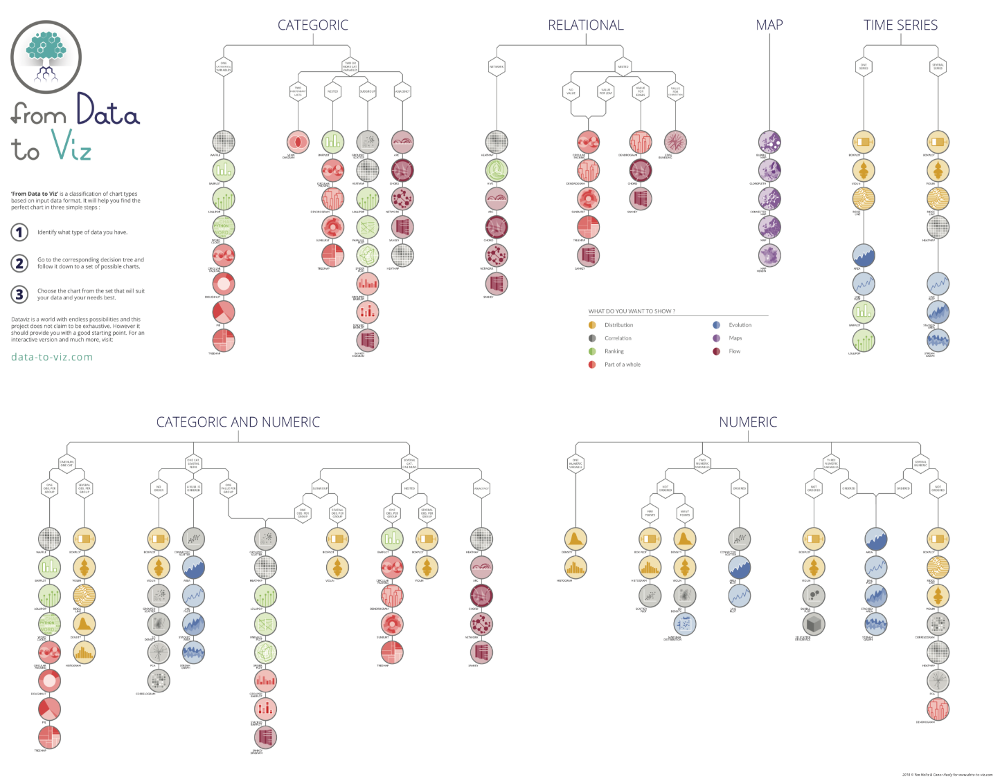
```
]]

---
class: center
# R for DataViz

```{r datatoviz-violin, out.width = "350px", echo=FALSE}
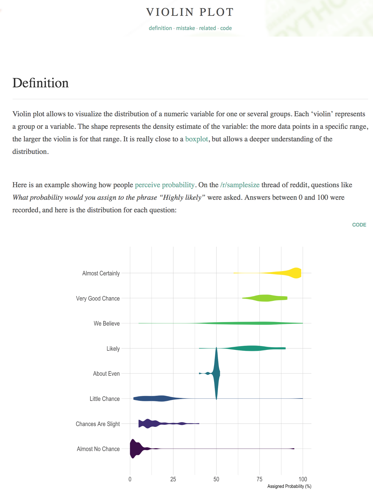
```

---
class: center
# Fun with R!

Want to add **GIFs** to your RMarkdown presentation?

```{r giphyr, tidy=TRUE, eval=FALSE}
install.packages("giphyr")

# install.packages("devtools")
devtools::install_github("haozhu233/giphyr") #<<
```

  
<i class="fa fa-github fa-fw"></i>Credits: haozhu233/giphyr
---
class: center
# Fun with R

Want to add **emojis** to your RMarkdown presentation? `r emo::ji("cool")`

```{r emo, tidy=TRUE, eval=FALSE}
# install.packages("devtools")
devtools::install_github("hadley/emo") #<<
```
<i class="fa fa-github fa-fw"></i>Credits: hadley/emo

--

Want **coffee stains** on your documents instead? `r emo::ji("coffee")`


<i class="fa fa-coffee fa-fw"></i>Credits: Hanno Rein | hanno-rein.de

---
class: center
# Acknowledgements

.pull-left[ .left[
#### People
- Camille Archer <i class="fa fa-university fa-fw"></i> ICER, MSU
- Arjun Krishnan <i class="fa fa-university fa-fw"></i> CMSE, MSU
- Nate Davis <i class="fa fa-university fa-fw"></i> MSU Data Science
- Nichole Nadkarni <i class="fa fa-industry fa-fw"></i> Red Fish Viral
- Katherine Simeon & Amy Wang <i class="fa fa-map-marker fa-fw"></i>Chicago
- Jen Richmond <i class="fa fa-map-marker fa-fw"></i> Sydney
- Jennifer Thompson <i class="fa fa-map-marker fa-fw"></i>Nashville
- Melina Vidoni <i class="fa fa-map-marker fa-fw"></i>Argentina
]]


.pull-right[ .left[
#### Packages & communities
- Xaringan theme | <i class="fa fa-github fa-fw"></i> yihui/xaringan
- R-Ladies Xaringan theme | <i class="fa fa-github fa-fw"></i> alison.rbind.io/
- KnitR, R Markdown, remark.js
- MeetupR for RLadies-stats | Gabriela de Queiroz <i class="fa fa-github fa-fw"></i> rshinylady
- R-Ladies Global community | <i class="fa fa-slack fa-fw"></i> <i class="fa fa-github fa-fw"></i>
]]

<i class="fa fa-users fa-fw"></i> _All you folks for being here for our Kick-off meeting!_

--

### Today's Sponsor!

```{r icermsu, out.width = "200px", echo=FALSE}

```


---
class: center
# Find us Online!

.pull-left[ .left[ 
#### R-Ladies
##### East Lansing
<a href="mailto:eastlansing@rladies.org"><i class="fa fa-paper-plane fa-fw"></i>&nbsp; eastlansing@rladies.org</a><br>
<a href="http://twitter.com/RLadiesELansing"><i class="fa fa-twitter fa-fw"></i>&nbsp; @RLadiesELansing</a><br>
<a href="http://meetup.com/rladies-east-lansing/"><i class="fa fa-meetup fa-fw"></i>&nbsp; rladies-east-lansing</a><br>
<a href="http://github.com/rladies-eastlansing"><i class="fa fa-github fa-fw"></i>&nbsp; @rladies-eastlansing</a><br>
<a href="https://rladies-eastlansing.slack.com"><i class="fa fa-slack fa-fw"></i>&nbsp; rladies-eastlansing.slack.com</a><br>
<a href="ICER #1455A, MSU"><i class="fa fa-map-marker fa-fw"></i>&nbsp; ICER, Michigan State University</a>

##### Global
<a href="https://rladies.org"><i class="fa fa-link fa-fw"></i>&nbsp; rladies.org</a><br>
<a href="http://twitter.com/RLadiesGlobal"><i class="fa fa-twitter fa-fw"></i>&nbsp; @RLadiesGlobal</a><br>

]]

--
.pull-right[ .left[ 
#### Organizers
##### Janani Ravi
<a href="mailto:jananiravi@rladies.org"><i class="fa fa-paper-plane fa-fw"></i>&nbsp; jananiravi@rladies.org</a><br>
<a href="http://github.com/jananiravi"><i class="fa fa-github fa-fw"></i>&nbsp; @jananiravi</a><br>
<a href="http://twitter.com/janani137"><i class="fa fa-twitter fa-fw"></i>&nbsp; @janani137</a><br>
<a href="https://jananiravi.github.io"><i class="fa fa-link fa-fw"></i>&nbsp; jananiravi.github.io</a><br>

##### Camille Archer
<a href="mailto:camille@rladies.org"><i class="fa fa-paper-plane fa-fw"></i>&nbsp; camille@rladies.org</a><br>
<a href="http://github.com/archerc5"><i class="fa fa-github fa-fw"></i>&nbsp; @archerc5</a><br>
<a href="http://twitter.com/camillearcher5"><i class="fa fa-twitter fa-fw"></i>&nbsp; @camillearcher5</a><br>
<a href="http://facebook.com/camille.archer.1"><i class="fa fa-facebook fa-fw"></i>&nbsp; camille.archer.1</a><br>
]]

--

```{r rladies-user2017, out.width = "200px", echo=FALSE}
knitr::include_graphics("../rladies-photos/2017-useR.jpg")
```


